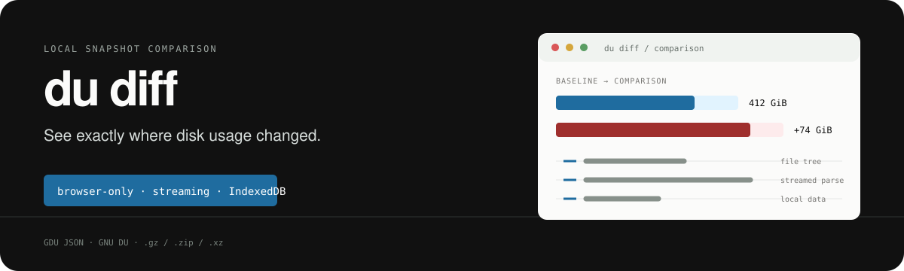

<p align="center">
  
</p>

<h1 align="center">du diff</h1>

<p align="center">
  Compare disk-usage snapshots in a browser, with no server and no filesystem data leaving the page.
</p>

<p align="center">
  <a href="#try-it-now">Try it now</a> ·
  <a href="#quick-start">Quick start</a> ·
  <a href="#supported-inputs">Supported inputs</a> ·
  <a href="#how-it-works">How it works</a> ·
  <a href="#limitations">Limitations</a>
</p>

## Try it now

The latest build is hosted on GitHub Pages and runs entirely in your browser:

<p align="center">
  <a href="https://rwahyudi.github.io/dudiff/">
    <strong>https://rwahyudi.github.io/dudiff/</strong>
  </a>
</p>

Open the link, upload a baseline and a later report, then choose **Process snapshots**. The HTTPS origin gives the page reliable IndexedDB storage, so large reports can be indexed without leaving the browser.

## What it does

`du diff` turns two disk-usage reports into a navigable comparison dashboard. Upload a baseline and a later snapshot to see:

- total storage and percentage change;
- largest increases and decreases;
- directory-level file counts and size deltas;
- extension and file-age summaries when the source provides them;
- a searchable, sortable file browser with resizable columns;
- the capture time embedded in GDU reports, or the source file modification time as a fallback.

The application is a single `index.html` artifact. Parsing happens in a Web Worker, reads are streamed, and indexed records are stored locally in IndexedDB.

## Quick start

No install step is required to use the application.

```bash
git clone https://github.com/rwahyudi/dudiff.git
cd dudiff
python3 -m http.server 8080
```

Open [http://localhost:8080](http://localhost:8080), then upload two reports and choose **Process snapshots**.

The [hosted version](https://rwahyudi.github.io/dudiff/) is the easiest way to use the app — its HTTPS origin gives browsers reliable IndexedDB support. The same `index.html` also works from `localhost` or `file://` when the browser permits IndexedDB for local files; if storage is unavailable, the interface reports the problem instead of silently falling back.

## Create reports

GDU JSON is the preferred format because it preserves file metadata and summary dimensions:

```bash
gdu -o baseline.gdu.json /path/to/data
gdu -o comparison.gdu.json /path/to/data
```

Compressed GDU files are accepted directly:

```bash
gdu -o- /path/to/data | gzip -c > baseline.gdu.json.gz
gdu -o- /path/to/data | gzip -c > comparison.gdu.json.gz
```

GNU `du` can be exported as a NUL-delimited, byte-sized report:

```bash
LC_ALL=C du --all --block-size=1 --null --time --time-style=+%s /path/to/data > baseline.du0
LC_ALL=C du --all --block-size=1 --null --time --time-style=+%s /path/to/data > comparison.du0
```

## Supported inputs

| Input | Extension | Detail |
| --- | --- | --- |
| GDU JSON | `.json`, `.gdu` | Preferred; includes file types, extensions, modification times, and GDU capture metadata when present. |
| GNU DU | `.du`, `.du0` | NUL-delimited byte counts; leaf entries remain unclassified. |
| Gzip | `.gz` | Browser-native streaming decompression. |
| ZIP | `.zip` | Browser-native DEFLATE entry streaming. |
| XZ | `.xz` | Loads the XZ decoder from `esm.sh` only when required, so network access is needed for XZ imports. |

## How it works

1. The browser reads each selected report incrementally.
2. A Web Worker parses and normalizes entries without blocking the interface.
3. Snapshot nodes and comparison changes are written to IndexedDB in batches.
4. The comparison view reads only the directory currently being browsed and virtualizes visible rows for large directories.
5. Search, sorting, navigation, CSV export, and column resizing happen locally.

No application server is involved, and the source reports are not uploaded by this project.

## Development

The runtime remains intentionally self-contained in `index.html`. GitHub Pages serves the file directly from the `master` branch, so the [hosted version](https://rwahyudi.github.io/dudiff/) refreshes automatically on every push. For local iteration, serve the repository with any static HTTP server, or use the package script to copy the artifact to a local web server document root:

```bash
npm run build
```

This command expects passwordless `sudo` access for `/var/www/html/dudiff.html`. For source-only iteration, serve the repository with any static HTTP server.

Validation is intentionally lightweight because the repository has no test runner, linter, or type-checker. Useful checks include:

```bash
git diff --check
npm run build
```

## Privacy and storage

- Report processing is local to the browser.
- IndexedDB stores imported nodes and comparisons for the page origin.
- **Clear local data** removes stored snapshots and comparisons.
- Browser quota and available disk space limit how much data can be indexed.
- The XZ decoder is the only optional network-loaded component.

## Limitations

- GNU DU reports cannot provide GDU-only extension and qualified file metadata.
- Browser storage quotas vary by browser and origin.
- Very large reports still require enough local storage for their normalized index.
- XZ input requires network access to load its decoder.

## License

No license has been selected yet. Until a license is added, the repository should be treated as all-rights-reserved source.
